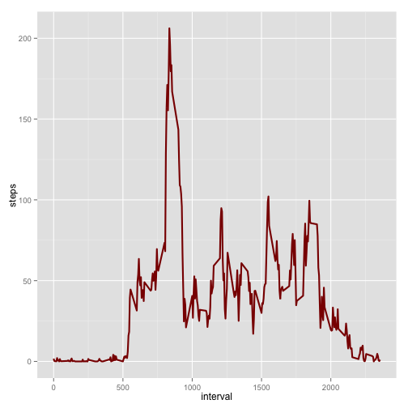

# Reproducible Research: Peer Assessment 1


## Loading and preprocessing the data
first let's create a nice thing


```r
library(ggplot2)
  setClass("simpleDate")
  setAs("character","simpleDate", function(from) as.Date(from, format="%Y-%m-%d") )
```
First, we are unzipping the file to the *zip* variable
Once it's unzip, we can load the data to a new variable 

```r
  zip<-unz("activity.zip",filename="activity.csv")
  stepAct <- read.csv(zip,  sep=",", na.strings=c("", " ", "?"), header=TRUE, colClasses=c("numeric", "simpleDate", "numeric"))
```
Let's check the summary of our dataset

```r
summary(stepAct)
```

```
##      steps            date               interval   
##  Min.   :  0.0   Min.   :2012-10-01   Min.   :   0  
##  1st Qu.:  0.0   1st Qu.:2012-10-16   1st Qu.: 589  
##  Median :  0.0   Median :2012-10-31   Median :1178  
##  Mean   : 37.4   Mean   :2012-10-31   Mean   :1178  
##  3rd Qu.: 12.0   3rd Qu.:2012-11-15   3rd Qu.:1766  
##  Max.   :806.0   Max.   :2012-11-30   Max.   :2355  
##  NA's   :2304
```

We'll have a first look to the number of steps per day with an histogram


```r
stepsPerDay <- aggregate(steps~date, stepAct, FUN=sum)
ggplot(data=stepsPerDay, aes(x=steps)) + geom_histogram(colour="black", fill="grey", binwidth=1000)
```

 
## What is mean total number of steps taken per day?

```r
paste("the mean per day is : ", mean(stepsPerDay$steps, na.rm=TRUE ))
```

```
## [1] "the mean per day is :  10766.1886792453"
```

```r
paste("the mean per day is : ", median(stepsPerDay$steps, na.rm=TRUE ))
```

```
## [1] "the mean per day is :  10765"
```
## What is the average daily activity pattern?


```r
meanStepsPerInterval <- aggregate(steps~interval, stepAct, FUN=mean)
summary(meanStepsPerInterval)
```

```
##     interval        steps       
##  Min.   :   0   Min.   :  0.00  
##  1st Qu.: 589   1st Qu.:  2.49  
##  Median :1178   Median : 34.11  
##  Mean   :1178   Mean   : 37.38  
##  3rd Qu.:1766   3rd Qu.: 52.83  
##  Max.   :2355   Max.   :206.17
```

```r
ggplot(meanStepsPerInterval, aes(x=interval, y=steps))+
  geom_line(color="steelblue", size=1) 
```

 

The maximal interval is : **835**

```r
meanStepsPerInterval[which.max(meanStepsPerInterval$steps),]$interval
```

```
## [1] 835
```


## Imputing missing values


```r
stepActImputed <- stepAct
rM  = merge(stepActImputed, meanStepsPerInterval, by="interval", suffixes=c("orig", "mean"))
rMna.idx = which(is.na(stepActImputed$steps))
stepActImputed[rMna.idx,"steps"] = rM[rMna.idx,"stepsmean"]
summary(stepActImputed)
```

```
##      steps            date               interval   
##  Min.   :  0.0   Min.   :2012-10-01   Min.   :   0  
##  1st Qu.:  0.0   1st Qu.:2012-10-16   1st Qu.: 589  
##  Median :  0.0   Median :2012-10-31   Median :1178  
##  Mean   : 37.8   Mean   :2012-10-31   Mean   :1178  
##  3rd Qu.: 29.0   3rd Qu.:2012-11-15   3rd Qu.:1766  
##  Max.   :806.0   Max.   :2012-11-30   Max.   :2355
```

```r
#str(stepAct)
#str(stepActImputed)
#meanStepsPerIntervalImputed <- aggregate(steps~interval, stepActImputed, FUN=mean)
#ggplot(meanStepsPerIntervalImputed, aes(x=interval, y=steps))+
#  geom_line(color="steelblue", size=1) 
meanStepsPerIntervalImputed <- aggregate(steps~date, stepActImputed, FUN=sum)
ggplot(data=meanStepsPerIntervalImputed, aes(x=steps)) + geom_histogram(colour="black", fill="grey", binwidth=1000)
```

 

```r
paste("the mean per day is : ", mean(meanStepsPerIntervalImputed$steps))
```

```
## [1] "the mean per day is :  10889.7992576554"
```

```r
paste("the mean per day is : ", median(meanStepsPerIntervalImputed$steps))
```

```
## [1] "the mean per day is :  11015"
```
## Are there differences in activity patterns between weekdays and weekends?


```r
stepActImputed$weekDays <- as.factor(ifelse(weekdays(stepActImputed$date) %in% c("Saturday","Sunday"), "Weekend", "Weekday")) 
meanWeekDaysActImputed <- aggregate(steps~interval+ weekDays, data=stepActImputed, mean)
ggplot(data=meanWeekDaysActImputed, 
                aes(x=interval, y=steps)) + 
             geom_line(color="steelblue", size=1) + 
             facet_wrap(~weekDays, nrow=2, ncol=1)
```

 

