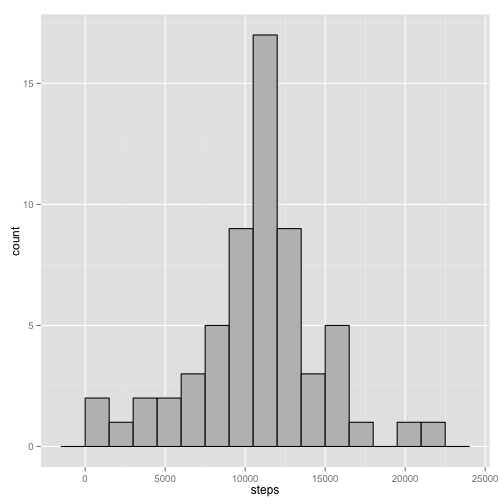
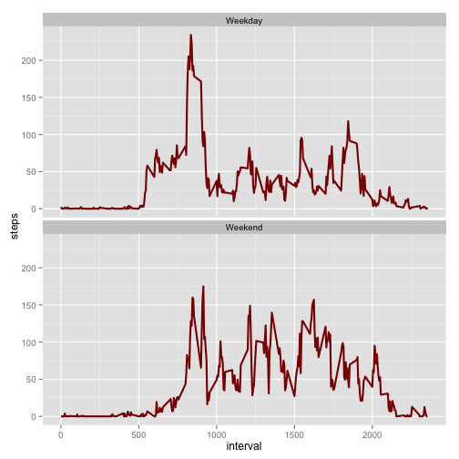

# Reproducible Research: Peer Assessment 1
**please check the commit with b236a211444126dee65a54b65f02e5d0d13f90e1**  
**I updated the Rmd as I was bothered by the change in mean and realized a  
bug in my code only after the end of the assignment deadline**

## Loading and preprocessing the data
First let's create some new simpleDate class to parse the csv


```r
library(ggplot2)
setClass("simpleDate")
setAs("character","simpleDate", function(from) as.Date(from, format="%Y-%m-%d") )
```
First, we are unzipping the file to the *zip* variable
Once it's unzip, we can load the data to a new variable 

```r
zip<-unz("activity.zip",filename="activity.csv")
stepAct <- read.csv(zip,  sep=",", na.strings=c("", " ", "?"), header=TRUE, colClasses=c("numeric", "simpleDate", "numeric"))
```
Let's check the summary of our dataset

```r
summary(stepAct)
```

```
##      steps            date               interval   
##  Min.   :  0.0   Min.   :2012-10-01   Min.   :   0  
##  1st Qu.:  0.0   1st Qu.:2012-10-16   1st Qu.: 589  
##  Median :  0.0   Median :2012-10-31   Median :1178  
##  Mean   : 37.4   Mean   :2012-10-31   Mean   :1178  
##  3rd Qu.: 12.0   3rd Qu.:2012-11-15   3rd Qu.:1766  
##  Max.   :806.0   Max.   :2012-11-30   Max.   :2355  
##  NA's   :2304
```

We'll have a first look to the number of steps per day with an histogram


```r
stepsPerDay <- aggregate(steps~date, stepAct, FUN=sum)
ggplot(data=stepsPerDay, aes(x=steps)) + geom_histogram(colour="black", fill="grey", binwidth=1000)
```

 
## What is mean total number of steps taken per day?


```r
paste("The mean is : ", mean(stepsPerDay$steps, na.rm=TRUE ))
```

```
## [1] "The mean is :  10766.1886792453"
```

```r
paste("The median is : ", median(stepsPerDay$steps, na.rm=TRUE ))
```

```
## [1] "The median is :  10765"
```

## What is the average daily activity pattern?


```r
meanStepsPerInterval <- aggregate(steps~interval, stepAct, FUN=mean, na.action=na.omit)
summary(meanStepsPerInterval)
```

```
##     interval        steps       
##  Min.   :   0   Min.   :  0.00  
##  1st Qu.: 589   1st Qu.:  2.49  
##  Median :1178   Median : 34.11  
##  Mean   :1178   Mean   : 37.38  
##  3rd Qu.:1766   3rd Qu.: 52.83  
##  Max.   :2355   Max.   :206.17
```

```r
ggplot(meanStepsPerInterval, aes(x=interval, y=steps))+
  geom_line(color="darkred", size=1) 
```

 

```r
paste("The interval with the max number of steps is : ",meanStepsPerInterval[which.max(meanStepsPerInterval$steps),]$interval )
```

```
## [1] "The interval with the max number of steps is :  835"
```

## Imputing missing values
For imputing the missing values, we will take the mean of the corresponding 5-minutes
interval.  
The merge function is used to merge the two datasets on interval.

```r
stepActImputed <- stepAct

rM  = merge(stepActImputed, meanStepsPerInterval, by="interval", suffixes=c("orig", "mean"))
rMna.idx = which(is.na(rM$stepsorig))
nbNa <- length(rMna.idx) 
summary(rM)
```

```
##     interval      stepsorig          date              stepsmean     
##  Min.   :   0   Min.   :  0.0   Min.   :2012-10-01   Min.   :  0.00  
##  1st Qu.: 589   1st Qu.:  0.0   1st Qu.:2012-10-16   1st Qu.:  2.49  
##  Median :1178   Median :  0.0   Median :2012-10-31   Median : 34.11  
##  Mean   :1178   Mean   : 37.4   Mean   :2012-10-31   Mean   : 37.38  
##  3rd Qu.:1766   3rd Qu.: 12.0   3rd Qu.:2012-11-15   3rd Qu.: 52.83  
##  Max.   :2355   Max.   :806.0   Max.   :2012-11-30   Max.   :206.17  
##                 NA's   :2304
```

```r
paste("The number of NA values is  : ",nbNa)
```

```
## [1] "The number of NA values is  :  2304"
```


```r
rM[rMna.idx,"steps"] = rM[rMna.idx,"stepsmean"]
summary(rM)
```

```
##     interval      stepsorig          date              stepsmean     
##  Min.   :   0   Min.   :  0.0   Min.   :2012-10-01   Min.   :  0.00  
##  1st Qu.: 589   1st Qu.:  0.0   1st Qu.:2012-10-16   1st Qu.:  2.49  
##  Median :1178   Median :  0.0   Median :2012-10-31   Median : 34.11  
##  Mean   :1178   Mean   : 37.4   Mean   :2012-10-31   Mean   : 37.38  
##  3rd Qu.:1766   3rd Qu.: 12.0   3rd Qu.:2012-11-15   3rd Qu.: 52.83  
##  Max.   :2355   Max.   :806.0   Max.   :2012-11-30   Max.   :206.17  
##                 NA's   :2304                                         
##      steps      
##  Min.   :  0    
##  1st Qu.:  2    
##  Median : 34    
##  Mean   : 37    
##  3rd Qu.: 53    
##  Max.   :206    
##  NA's   :15264
```

```r
rM[is.na(rM$steps),"steps"] = rM[is.na(rM$steps),"stepsorig"]

summary(rM)
```

```
##     interval      stepsorig          date              stepsmean     
##  Min.   :   0   Min.   :  0.0   Min.   :2012-10-01   Min.   :  0.00  
##  1st Qu.: 589   1st Qu.:  0.0   1st Qu.:2012-10-16   1st Qu.:  2.49  
##  Median :1178   Median :  0.0   Median :2012-10-31   Median : 34.11  
##  Mean   :1178   Mean   : 37.4   Mean   :2012-10-31   Mean   : 37.38  
##  3rd Qu.:1766   3rd Qu.: 12.0   3rd Qu.:2012-11-15   3rd Qu.: 52.83  
##  Max.   :2355   Max.   :806.0   Max.   :2012-11-30   Max.   :206.17  
##                 NA's   :2304                                         
##      steps      
##  Min.   :  0.0  
##  1st Qu.:  0.0  
##  Median :  0.0  
##  Mean   : 37.4  
##  3rd Qu.: 27.0  
##  Max.   :806.0  
## 
```

```r
meanStepsPerIntervalImputed <- aggregate(steps~date, rM, FUN=sum)
ggplot(data=meanStepsPerIntervalImputed, aes(x=steps)) + geom_histogram(colour="black", fill="grey", binwidth=1500)
```

 

```r
paste("The mean  is : ", mean(meanStepsPerIntervalImputed$steps))
```

```
## [1] "The mean  is :  10766.1886792453"
```

```r
paste("The median is : ", median(meanStepsPerIntervalImputed$steps))
```

```
## [1] "The median is :  10766.1886792453"
```
These new values **do** increase the mean and median, so not only they are different but they also increased their values.
## Are there differences in activity patterns between weekdays and weekends?


```r
stepActImputed$weekDays <- as.factor(ifelse(weekdays(stepActImputed$date) %in% c("Saturday","Sunday"), "Weekend", "Weekday")) 
meanWeekDaysActImputed <- aggregate(steps~interval+ weekDays, data=stepActImputed, mean)
ggplot(data=meanWeekDaysActImputed, 
       aes(x=interval, y=steps)) + 
  geom_line(color="darkred", size=1) + 
  facet_wrap(~weekDays, nrow=2, ncol=1)
```

 

As we can see with the plots, there are **some differences between the two graphs**.  
During the week days, in the **earlier** moment of the days, we can see that the number of steps are higher, most likely due to people waking up to go to work.  
During the weekdays/daytime, we can assume that people are **less active** as they are working until they get off from work.  
During the week end, the average is more **spread** accross the day.
